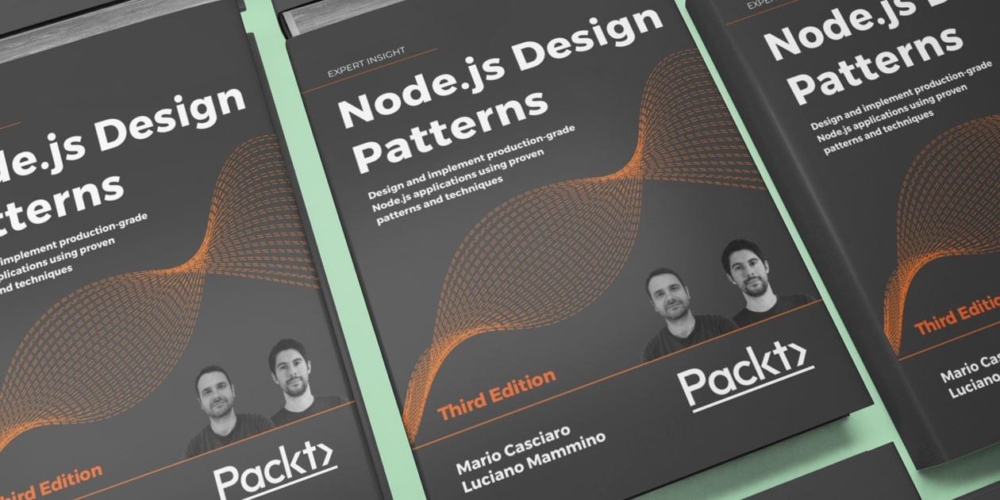

# enterprisevue.dev


The website source code for possibly the [Best Vue.js book](https://www.enterprisevue.dev/) out there: Architecting Vue.js 3 Enterprise-Ready Web Applications 😊

[](https://www.enterprisevue.dev/)

## Dependencies

Install dependencies with

```bash
npm install
```

## Run

Run the local development server (with auto-reload):

```bash
npm start
```

Run the build with:

```bash
npm run build
```

## Support this book

A book is a work of art and passion. I invested a lot of my time and tried my best to create a great book and I hope I managed to give you something valuable with my efforts. If you enjoyed this book, here are some ways you can help us to spread the word and support my work:

- Leave a review on [Amazon.com](https://amzn.to/3mIAVhA) (or other Amazon stores), on [Packt.com](https://www.packtpub.com/product/architecting-vuejs-3-enterprise-ready-web-applications/9781801073905)
- Share the book's website on Social media ([Share on Twitter](https://twitter.com/intent/tweet?text=Check%20out%20Architecting%20Vue.js%203%20Enterprise-Ready%20Web%20Applications%20if%20you%20want%20to%20take%20your%20Vue.js%20knowledge%20to%20the%20next%20level:%20%20https://www.enterprisevue.dev/), [Share on Pinterest](https://www.pinterest.com/pin-builder/?description=Check%20out%20Architecting%20Vue.js%203%20Enterprise-Ready%20Web%20Applications%20if%20you%20want%20to%20take%20your%20Vue.js%20knowledge%20to%20the%20next%20level:%20%20&media=https%3A%2F%2Fwww.enterprisevue.dev%2Fimg%2Fnode-js-design-patterns.jpg&method=button&url=https://www.enterprisevue.dev/), [Share on LinkedIn](http://www.linkedin.com/shareArticle?mini=true&url=https%3A%2F%2Fwww.architecting.io%2F&title=Check%20out%20Architecting%20Vue.js%203%20Enterprise-Ready%20Web%20Applications%20if%20you%20want%20to%20take%20your%20Vue.js%20knowledge%20to%20the%20next%20level%3A%20),
<!-- - Check out and follow this project on [Product Hunt](#) and [Indie Hackers](#) -->
- Follow the author on Twitter: [Solomon Eseme](https://twitter.com/kaperskyguru)

THANK YOU ❤️
